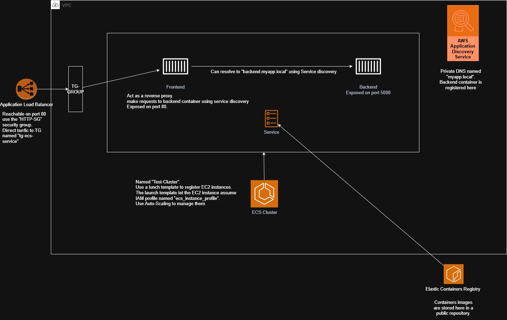

# Simple Cluster

This is a simple cluster of a frontend and backend built with docker and terraform.

The frontend is a react app that makes a request to the backend service once clicked.

The backend is an express app that listens on port 5000 and returns a response which is handled by the frontend.

The whole project is deployed to AWS using terraform and docker.

The terraform configuration is in the `terraform` directory.

The docker configuration is in the `Dockerfile`s in the `backend` and `frontend` directories.

The react app is in the `frontend` directory.

The express app is in the `backend` directory.

To deploy the cluster, you can run `terraform init` and `terraform apply` in the `terraform` directory.